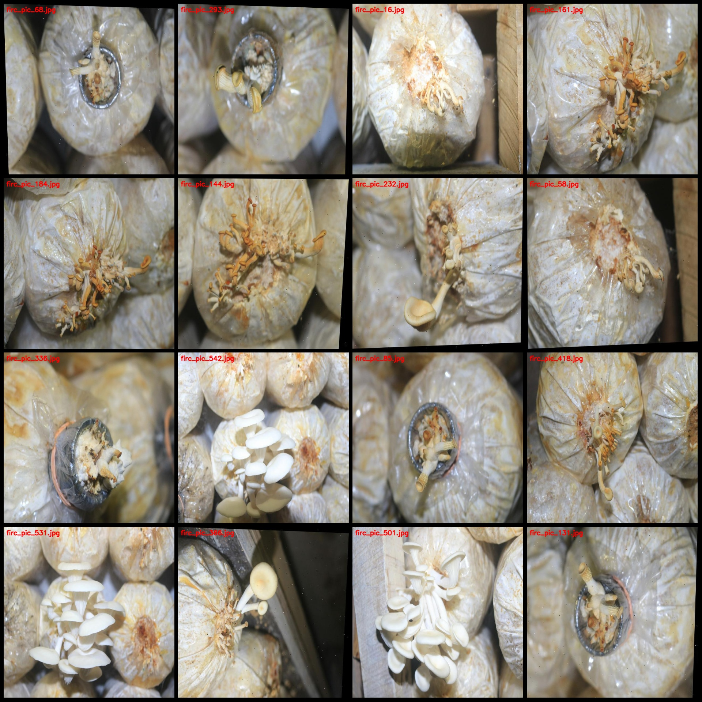
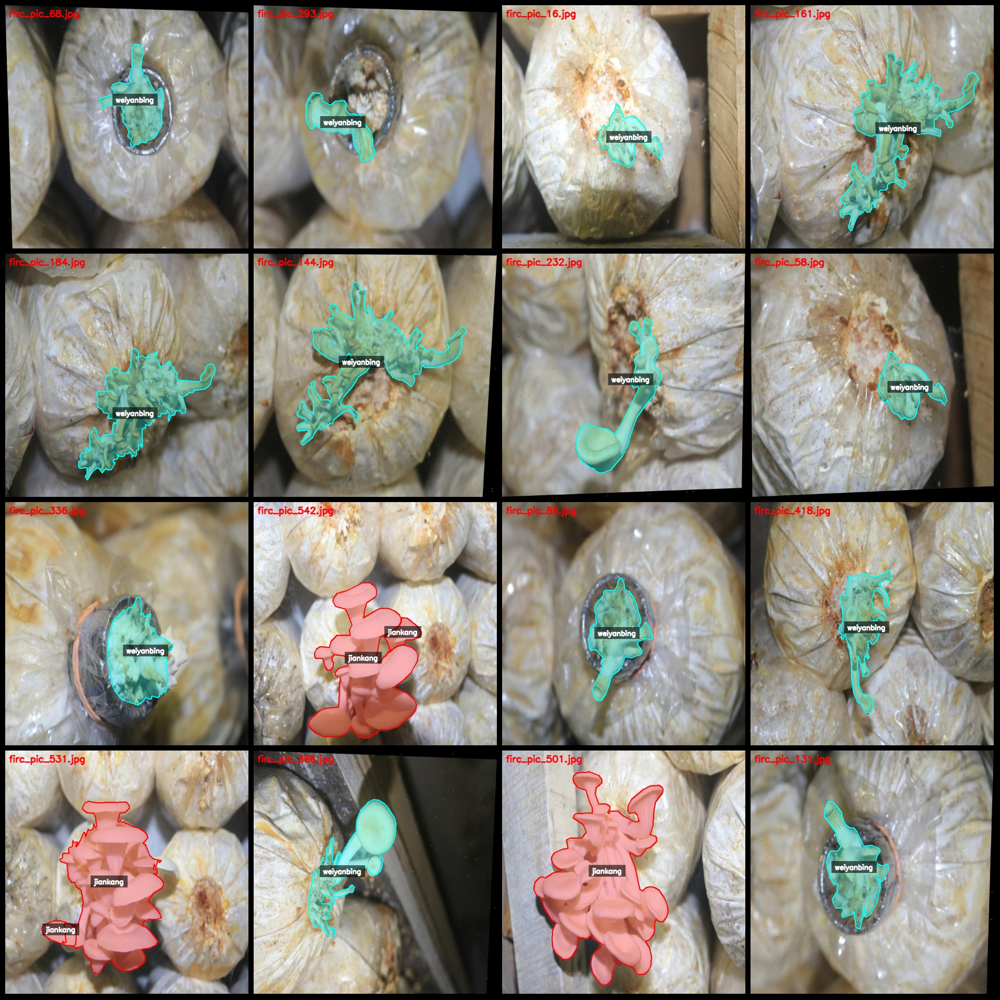
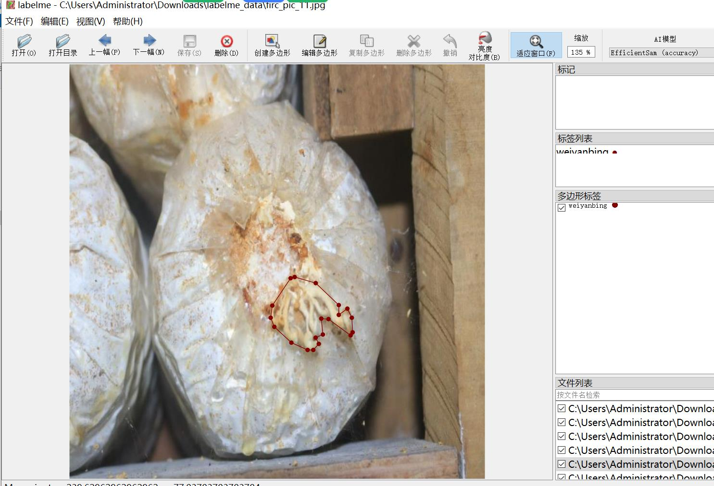
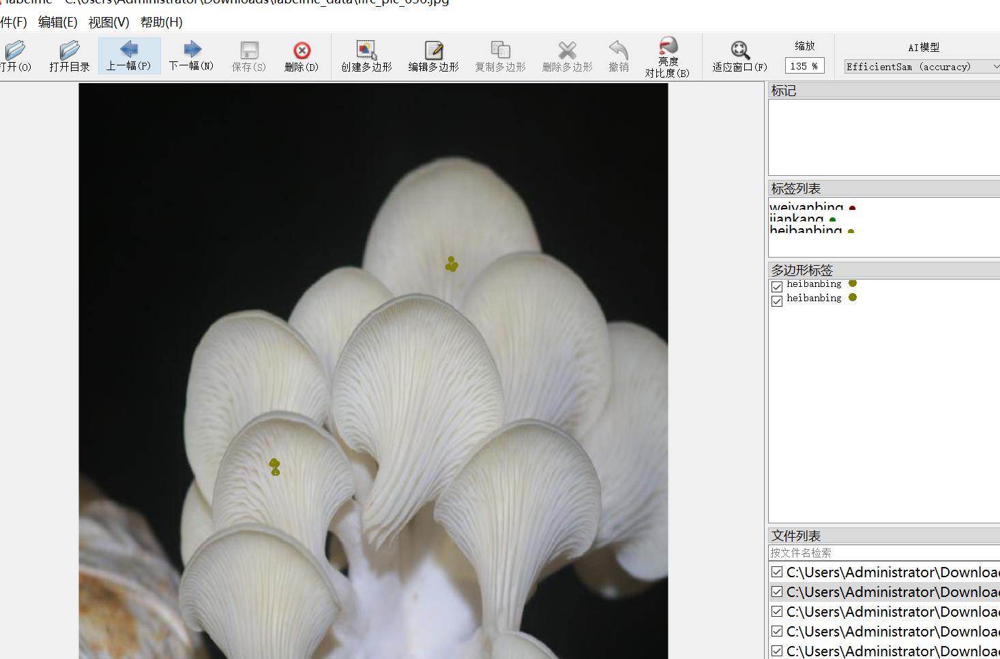

# Rhizopus Disease Identification and Segmentation Dataset in LabelMe format, 535 Categories

The dataset consists of 535 images in labelme format, with only the image files and corresponding JSON files included. The number of image files is 535, and the number of labeled JSON files is also 
535. There are 3 categories of labels: "heibanbing", "jiankang", and "weiyanbing".

Each category has a count of labeled frames:
- Heibanbing (Black Spot Disease): 782
- Jiankang (Healthy): 169
- Weiyanbing (Wilting Disease): 266

Total labeled frames: 1217

The labeling tool used is labelme version 5.5.0.
The image resolution is 640x640.

The labeling rules involve drawing polygons around the categories.

Important Note: You can open this dataset in labelme for editing. The JSON dataset needs to be converted into either mask or yolo format or coco format for semantic segmentation or instance 
segmentation.

Special Reminder: This dataset does not guarantee the accuracy of the trained models or weight files.

Image Preview:

Example of labeled images:

Labeled drawing example:

Original Image (select 16 random images):

Labeled drawing result:

## Images

Here is a pay link on Stripe ( https://buy.stripe.com/3cs8yP7sY87d0vu9AB ). Please contact me lonlonago@foxmail.com after funding $89, and I will send you a complete data files , thank you!

